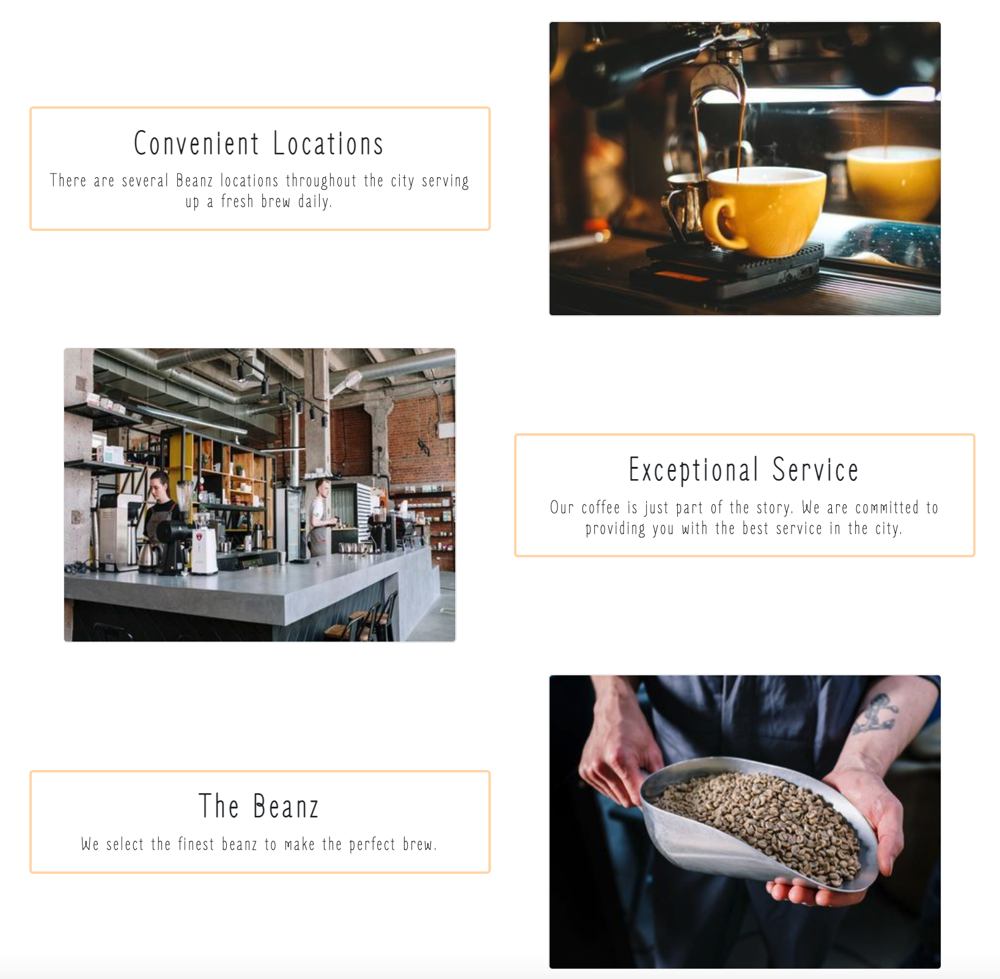

# Beanz

## Project by: Lisa Harrison & Kurt Reynolds


## Beanz

A website created for a local coffee shop utilising React, React-Reveal, Bootstrap & SCSS

Includes About Section:


Features:


## Installation Options

To install the project dependencies, execute the following:
```jsx
npm install
or
yarn install
```


### Credits

All images, available for public use, were sourced from pexels.com. 
This project does not claim any ownership or credit over the images.
Images are available to download here:

https://images.pexels.com/photos/2067628/pexels-photo-2067628.jpeg?auto=compress&cs=tinysrgb&w=1260&h=750&dpr=1

Photo by cottonbro:
https://www.pexels.com/photo/person-holding-brown-beans-in-white-ceramic-bowl-4820813/
https://www.pexels.com/photo/woman-in-white-long-sleeve-shirt-sitting-on-chair-4790059/

Photo by Tim Douglas :
https://www.pexels.com/photo/cheerful-baristas-in-aprons-standing-near-coffee-house-6205762/
